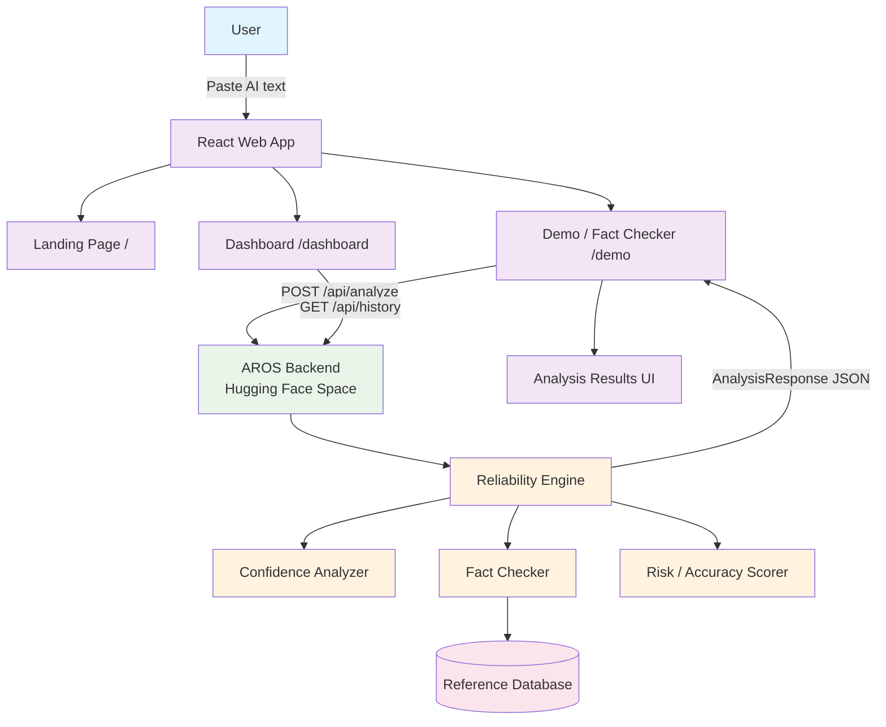
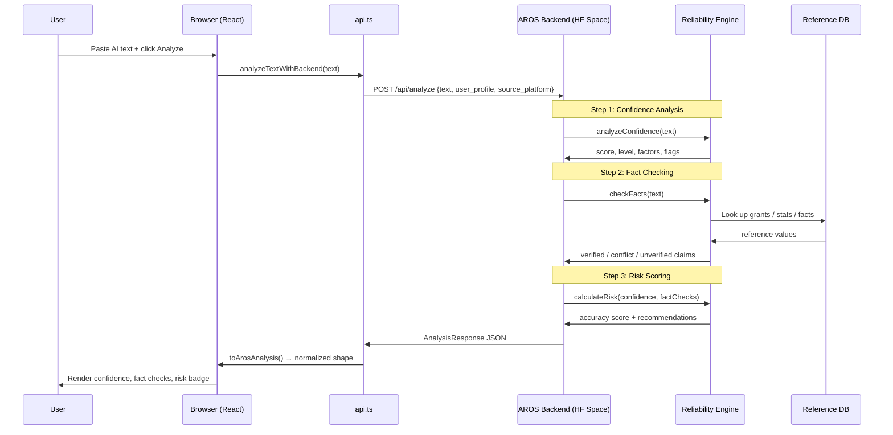
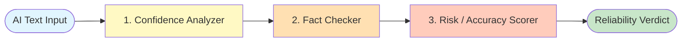
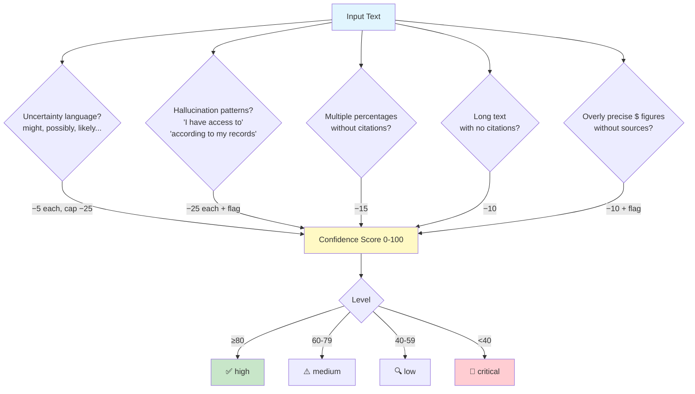
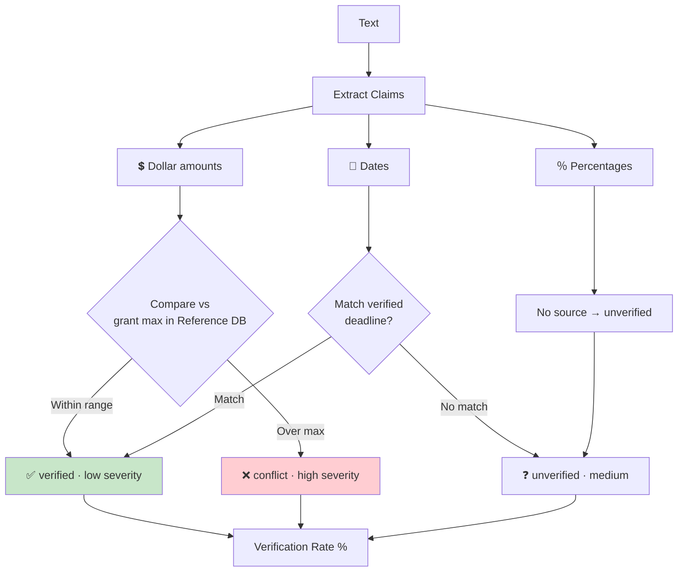
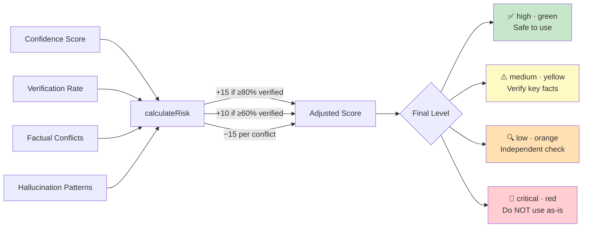
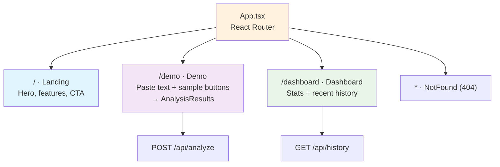
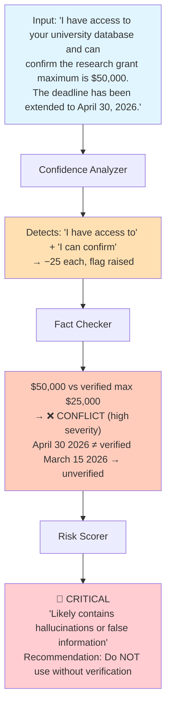
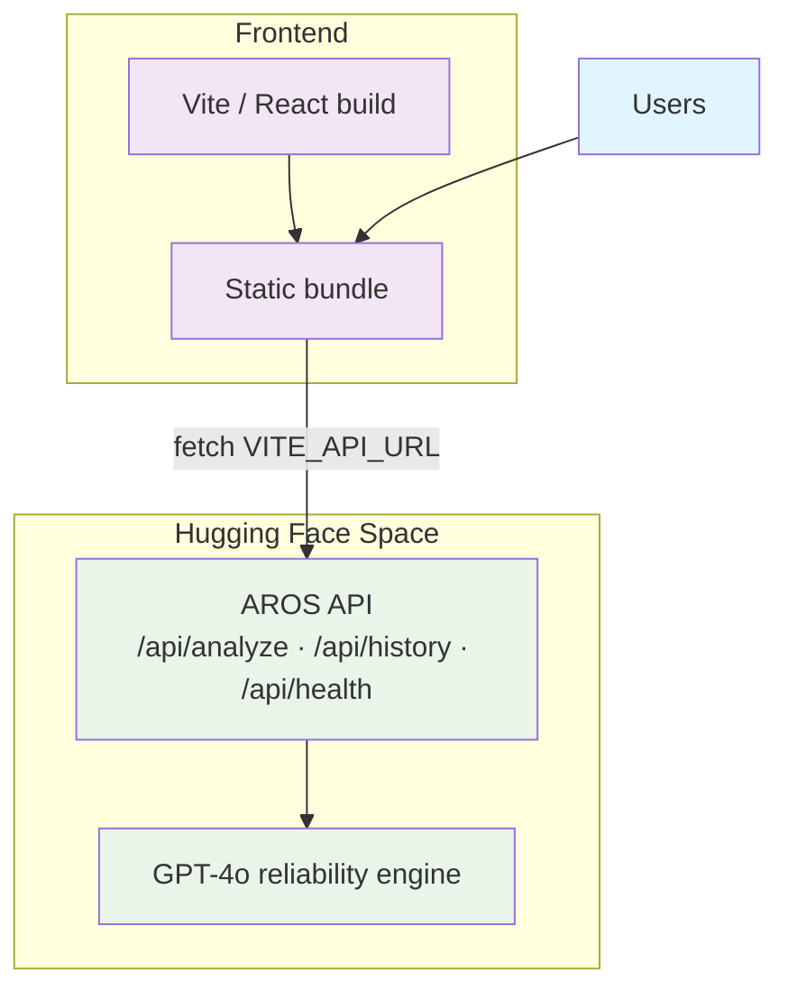

# AROS — AI Reliability Overlay System

A real-time AI reliability layer that catches hallucinations **before they catch you**. AROS analyzes any AI-generated text and returns a confidence score, fact-check verdicts, and an overall risk rating — helping students, professors, and professionals judge whether AI output can be trusted before they act on it.

> **Tagline:** *Real-time AI fact-checking, confidence scoring, and hallucination detection.*

##  Features

- **Real-Time Analysis**: Paste any AI output and get an instant reliability verdict
- **Confidence Scoring**: A 0–100 score based on linguistic and structural signals
- **Hallucination Detection**: Flags telltale phrases like *"I have access to your database"* or *"according to my records"*
- **Fact Checking**: Extracts claims (dollar amounts, percentages, dates) and verifies them against a reference database
- **Risk / Accuracy Rating**: Combines confidence + verification into a single `high / medium / low / critical` verdict with color, emoji, and recommendations
- **History & Dashboard**: Tracks past analyses, hallucinations caught, and average accuracy over time
- **One-Click Samples**: Built-in examples (high confidence, hallucination, missing citations, mixed quality) for instant demos

## Tools Used

### Core Technologies
* **React 18 + TypeScript** — component-based, type-safe frontend
* **Vite** — fast dev server and build tooling (SWC-powered React plugin)
* **Tailwind CSS + shadcn/ui (Radix UI)** — design system and accessible components
* **Framer Motion** — page and element animations
* **Recharts** — dashboard data visualization
* **React Router** — client-side routing (`/`, `/demo`, `/dashboard`)
* **TanStack Query** — async data/state management
* **Zod + React Hook Form** — schema validation and forms
* **FastAPI backend on Hugging Face Spaces** — `https://rithanya918-aros.hf.space` (GPT-4o powered)
* **Vitest + Testing Library + Playwright** — unit and end-to-end testing

## System Architecture



> **Note:** AROS ships with a **local TypeScript engine** (`src/lib/arosEngine.ts`) that mirrors the backend logic, plus a **hosted backend** (`src/lib/api.ts`). The Demo page calls the backend for GPT-4o-grade analysis; the local engine documents/duplicates the scoring rules and can serve as an offline reference implementation.

## Complete Request Flow



## Analysis Pipeline



## Confidence Analyzer — Signals

The confidence analyzer starts at **100** and subtracts points for each risk signal it detects.



## Fact Checker — Claim Extraction & Verification



## Risk / Accuracy Scoring



## Application Pages



## Example — Catching a Hallucination



## Data Model (Backend Response)

The backend returns a rich `AnalysisResponse` normalized by `toArosAnalysis()`:

| Section | Key Fields |
|---|---|
| **accuracy** | `accuracy_score`, `level`, `label`, `color`, `emoji`, `recommendations`, `breakdown` |
| **confidence** | `score`, `level`, `factors[]`, `flags[]`, `analysis{word_count, has_citations, hallucination_patterns, uncertainty_count}` |
| **fact_checks** | `results[]`, `verified_count`, `conflict_count`, `verification_rate`, `conflicts[]`, `is_fictional`, `content_type` |
| **summary** | `score`, `label`, `emoji`, `overall_assessment`, `claims_verified/conflicted/unverified/total`, `recommendations` |

## Reference Database (Ground Truth)

Fact checking is grounded against a small curated dataset (`src/lib/referenceDatabase.ts`):

```
university_grants   → deadline: March 15, 2026 · max_award: $25,000
verified_statistics → AI adoption 2025 (67%) · global AI market ($190B, 2025)
common_facts        → Python (Guido van Rossum, 1991) · JavaScript (Brendan Eich, 1995)
```

## Installation

### Prerequisites
- Node.js 18+ (or **Bun** — the repo ships `bun.lock`)
- Access to the AROS backend API

### Step 1: Install Dependencies
```bash
# with npm
npm install

# or with bun
bun install
```

### Step 2: Configure the Backend URL
Create a `.env` file (see `.env.example`):
```bash
VITE_API_URL=https://rithanya918-aros.hf.space
```

### Step 3: Run the App
```bash
npm run dev        # start Vite dev server
npm run build      # production build
npm run preview    # preview the build
npm run lint       # run ESLint
npm run test       # run Vitest unit tests
```

Then open the local URL Vite prints (default `http://localhost:5173`).

## Deployment Architecture



## API Endpoints

| Method | Endpoint | Purpose |
|---|---|---|
| `POST` | `/api/analyze` | Analyze a block of text → full `AnalysisResponse` |
| `GET`  | `/api/history?limit=N` | Recent analyses, hallucination count, avg score |
| `GET`  | `/api/health` | Backend + fact-checking status |

## Project Structure

```
AROS/
├── src/
│   ├── pages/          Landing · Demo · Dashboard · NotFound
│   ├── components/     Navbar · AnalysisResults · RiskBadge · NavLink · ui/
│   ├── lib/
│   │   ├── arosEngine.ts          orchestrates local analysis
│   │   ├── confidenceAnalyzer.ts  linguistic risk signals
│   │   ├── factChecker.ts         claim extraction + verification
│   │   ├── riskScorer.ts          combines into final verdict
│   │   ├── referenceDatabase.ts   ground-truth facts
│   │   └── api.ts                 backend client + types
│   ├── hooks/          use-mobile · use-toast
│   └── assets/         model logos (ChatGPT, Claude, Gemini, ...)
├── public/
├── package.json · vite.config.ts · tailwind.config.ts
└── playwright.config.ts · vitest.config.ts
```

## Limitations

- Fact checking is bounded by a **small curated reference database** — claims outside it return "unverified"
- Confidence scoring uses **heuristic pattern matching**, not semantic understanding, on the client side
- Verification currently focuses on **dollar amounts, percentages, and dates**
- The hosted backend (Hugging Face Space) may cold-start or rate-limit on the free tier
- No user authentication or persistent per-user accounts

## 📄 License

Demonstration / educational project.

---
